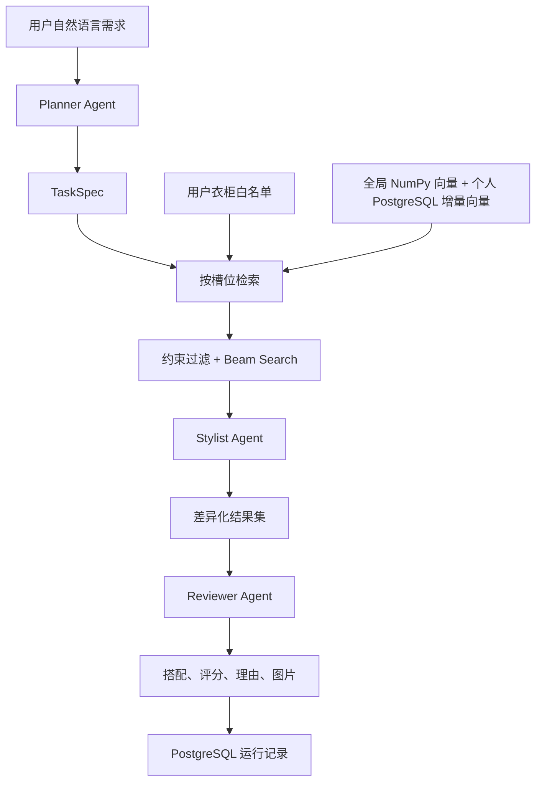
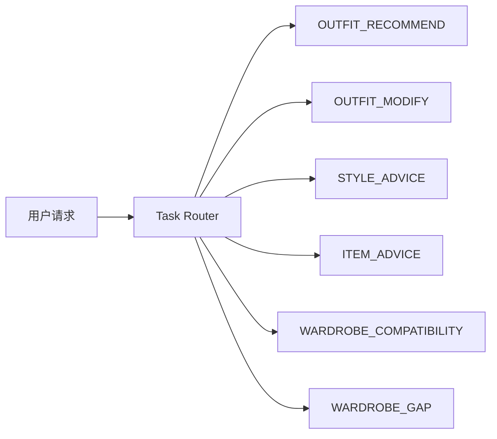

# StyleForge 系统架构

## 1. 设计目标

系统必须满足四条边界：

1. 只推荐当前用户衣柜内的真实商品 ID。
2. 明确约束由代码执行，Agent 无权覆盖硬约束。
3. 模型、向量或 API 不可用时能够降级，不编造结果。
4. 每次请求可以追踪、持久化并离线评估。

## 2. 总体流程



v3.3 在主推荐链路之前新增独立 `Task Router`。它是系统能力，不是第四个 Agent。六类任务现在共享 `TaskExecutionInput`、`ContextPack` 和 `task_runs` 持久化契约；标准推荐复用原工作流，五类扩展任务也统一由 SemanticRetriever / Composer / Critic 三个主 Agent 执行。路由模式与执行模式分离：`/tasks/route` 只分类，`/tasks/execute` 才运行业务。



## 3. 组件职责

### Planner Agent

- 输入：用户 ID、原始需求、最大结果数。
- 输出：`TaskSpec`。
- 负责：场合、颜色、必需槽位、必选品类和子类、排除子类。
- 不负责：选择商品或生成商品 ID。

### Slot Retriever

- 为每个必需槽位生成英文 FashionCLIP 提示。
- 只对当前用户衣柜 ID 对应的向量评分。
- 不把全局数据集商品直接推荐给用户。
- FashionCLIP 不可用时返回明确的降级原因。

个人衣柜推荐当前不调用 FAISS。数据集商品通过 `CatalogVectorStore` 对白名单行执行 NumPy 精确内积；个人订单商品的增量向量保存在 `personal_item_embeddings`，检索时只查询当前白名单 ID 并与全局分数合并。FAISS 用于全目录检索和离线评估。

### Candidate Generator（最新实现尚待回归）

- 执行商品归属、颜色、品类、子类、槽位和重复单品约束。
- 最新代码使用有界 beam search 生成最多 2,000 个候选；此前已验证版本使用截断组合搜索。
- 对每个候选计算规则分和语义相关度。
- 候选为零时输出阻塞槽位，不调用 Agent 编造方案。

### Stylist Agent（最新差异化规则尚待回归）

- 只接收已通过硬约束的候选。
- 按分数排序，并优先选择互不重复的结果。
- 候选不足时允许回退到最优重叠结果。

### Reviewer Agent

- 复核 `hard_valid`、衣柜归属和槽位完整性。
- 不能修改分数、商品 ID 或绕过硬约束。
- 返回接受或无解说明。

### Context Router 与 Weather Tool

- Agent 1 输出结构化 `context_requirements.weather`，程序只执行经过 Schema 校验的参数。
- Context Router、Tool Registry 和 Open-Meteo Provider 是共享能力，不新增 Agent，也不直接生成穿搭建议。
- 天气成功时，同一个 Agent 1 基于事实细化检索；Agent 2 组合，Agent 3 审校实穿性。
- 事实写入 Context Pack、工作流输出、trace 与持久化明细。详细契约见[天气上下文工具](WEATHER_CONTEXT.md)。
- 当前实现是进程内 typed Tool；尚未实现 MCP Client/Server 协议，因此不能对外表述为 Weather MCP。

## 4. 约束层次（子类和多配饰字段尚待回归）

```text
TaskSpec
├── required_slots
│   ├── top
│   ├── bottom
│   ├── footwear
│   ├── accessory
│   └── accessory_1 / accessory_2
├── required_item_types_by_slot
│   └── bottom: [skirt]
├── required_subtypes_by_slot
│   ├── top: [shirt]
│   └── footwear: [loafers]
├── excluded_subtypes_by_slot
│   └── footwear: [high_heels]
├── preferred_colors
└── excluded_colors
```

子类约束使用商品名称、描述和特征字段进行可审计匹配。FashionCLIP 负责排序，而不是决定硬约束是否满足。

## 5. 数据边界

运行记录与业务表全部落在本地 **PostgreSQL**（`STYLEFORGE_DATABASE_DSN`）。会话级穿搭产出可选走 **Redis** 读穿缓存（`STYLEFORGE_REDIS_ENABLED`），知识检索在关键词之外叠加 **Chroma** 向量路径（`STYLEFORGE_CHROMA_DIR`）；两者均为可选外部服务，异常自动降级，不影响主链路。

- `catalog_items`：数据集商品目录，不能自动等同于用户衣柜。
- `wardrobe_items`：用户与商品的显式映射，是推荐白名单。
- `wardrobe_import_batches/rows`：订单文件级幂等和逐行确认审计。
- `personal_wardrobe_items`：确认拥有的个人商品及购买信息。
- `personal_item_embeddings`：无需重建全局矩阵的个人增量向量。
- `dataset_outfits`：离线兼容性与评估数据，不直接作为个人衣柜。
- `styling_runs`：每次推荐的任务、状态和结果。
- `candidate_outfits`：已选择候选及评分证据。

## 6. 服务边界

### FastAPI

- `/health`：数据库、嵌入和索引状态。
- `/recommendations`：运行完整多 Agent 流程。
- `/tasks/route`：只选择 v3.3 任务子图并返回可审计路由信息。
- `/tasks/execute`：统一执行六类任务，返回 `Context Pack + result + trace` 并持久化运行记录。
- `/tasks/{user_id}/{run_id}`：读取当前用户的一次扩展任务运行，用户 ID 不匹配时返回 404。
- `/catalog/search`：按元数据搜索商品。
- `/wardrobes/{user_id}`：读取用户衣柜。
- `/wardrobes/{user_id}/items`：添加或停用衣柜商品。
- `/wardrobes/{user_id}/imports`：订单上传、预览和确认提交。
- `/wardrobes/{user_id}/items/{item_id}/image`：个人实拍图与自动重新嵌入。
- `/items/{item_id}/image`：安全读取外部图片目录中的商品图。

### Streamlit

- 输入穿搭需求。
- 展示每套方案的图片、名称、颜色、评分和理由。
- 展示 Agent 轨迹及诊断。
- 管理演示衣柜。

## 7. 降级与失败策略

| 故障 | 行为 |
|---|---|
| 衣柜为空 | 返回 `infeasible` 和缺失槽位 |
| FashionCLIP 不可用 | 使用规则候选，记录 `fallback_reason` |
| 缺少必选子类 | 返回无解，不放宽硬约束 |
| 图片不存在 | API 返回 404，不使用替代商品冒充 |
| Agent 输出非法 ID | Reviewer 拒绝 |
| 节点异常 | 写入失败运行记录并抛出明确错误 |
| 五类扩展任一 Agent 不可用/超时/JSON 非法 | 不生成降级结果，任务记录为 `failed` |
| 本地知识未覆盖 | 作为证据限制交给三 Agent 判断，不用模板冒充结论 |
| 新品兼容性分析 | 新品只作为瞬态候选，不写入目录或用户衣橱 |
| Weather Provider 不可用 | 写入 `environment_context.weather.status=unavailable`，不生成天气主张，主推荐继续 |

> 上表中 FashionCLIP/规则候选降级只适用于标准穿搭推荐。五类扩展任务统一使用严格三 Agent 链，没有确定性结果降级。
