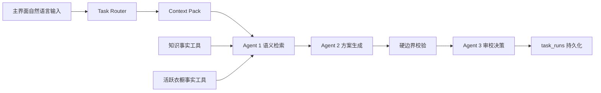

# 扩展任务业务与 API

> 版本：v3.3-extension strict-three-agent（2026-08-09）
> 范围：局部修改、风格知识、单品搭配、新品兼容性、衣橱缺口

## 1. 唯一执行链



五类扩展任务不再有独立 Service 决策层，也没有确定性结果降级。它们共用现有三位主 Agent；变化只发生在任务提示词、输入输出 Schema、事实工具和硬校验规则。

- 正常成功任务由 Agent 1/2/3 各调用一次，`llm_call_count=3`。Agent 2 结构不完整时允许同一 Agent 修复一次；Agent 3 语义拒绝时允许一次 `Agent 2 重做 → Agent 3 复审`，最坏不超过 7 次调用。
- 缺少模型、超时、无效 JSON、Schema 不合格或 Agent 3 拒绝时，任务明确失败并写入 `task_runs.error_message`。
- 确定性代码只读取衣橱/知识事实和执行不可绕过的 ID、锁定槽位、证据来源、瞬态新品校验；不能生成或修补建议。
- 标准 `outfit_recommend` 保留原工作流和原降级策略，本规则只约束五类扩展任务。

## 2. Context Pack

| 分区 | 内容 |
|---|---|
| `request_context` | 原始请求、自动路由类型、原因与置信度 |
| `outfit_context` | 当前方案、当前单品、锁定单品、允许编辑槽位 |
| `environment_context` | 天气、季节预留 |
| `knowledge_context` | 带 `source/source_id/section` 的风格、单品和衣橱证据 |
| `user_context` | 当前用户衣橱统计、偏好、最近请求记忆 |
| `candidate_item` | 兼容性任务的瞬态新品；不会写入目录或衣橱 |

Context Pack 是三位 Agent 共享的同一份可审计上下文，不是第四个 Agent。

## 3. API 与主界面

`POST /tasks/execute`

```json
{
  "user_id": "demo-user",
  "request": "要搭配中世纪风格的话，我的衣柜还缺什么？",
  "max_results": 3
}
```

主 Web 和小程序只发送自然语言，不传 `requested_task_type`。后端字段仍为测试、内部受控调用和兼容性保留。响应包含：

```json
{
  "task_type": "wardrobe_gap",
  "selected_subgraph": "wardrobe_gap_subgraph",
  "status": "completed",
  "context_pack": {},
  "agent_outputs": {"agent1": {}, "agent2": {}, "agent3": {}},
  "result": {},
  "trace": [],
  "llm_enabled": true,
  "llm_call_count": 3
}
```

`GET /tasks/{user_id}/{run_id}` 读取一次运行；用户不匹配返回 404。模型不可用返回 503，模型 JSON/Schema 不合法返回 502，业务输入或硬边界不合法返回 422/500 并保留失败记录。

## 4. 五类业务语义

### 4.1 局部修改

Agent 1 解析最近一次或显式当前搭配和目标槽位；非目标单品写入硬锁定集合。Agent 2 只能从目标槽位候选中替换，Agent 3 审校是否保持其余单品。任何备选丢失锁定 ID、保留被替换 ID 或引用候选范围外 ID 都会失败，不自动修补。

### 4.2 风格知识

本地 Markdown 是支撑证据，不是能否回答的开关。Agent 1 同时读取风格证据和衣橱落地单品；Agent 2 给出风格原则与当前衣橱可执行方案；Agent 3 检查有无把未知信息写成事实。当前知识增加了中世纪灵感风格条目。

### 4.3 单品搭配

“黑色马甲怎么搭？”会先解析衣橱内的锚点马甲；找到唯一衣橱锚点后，Agent 1 检索可搭配的下装、鞋履等候选，Agent 2 组合样例，Agent 3 检查样例是否保留锚点且所有支撑单品来自衣橱。知识条目只是补充解释，未命中知识库也不能直接冒充业务失败原因。

单品任务的 `completed` 是强业务契约：必须包含已解析锚点、至少一个非空兼容分组和至少一套 `sample_outfits`；每套必须含锚点、衣橱支撑单品和组合理由。Agent 1 已解析锚点时，缺少场合、季节或更多偏好不能触发 `needs_clarification`。

### 4.4 新品兼容性

用户可直接自然语言描述新品，或内部调用传 `candidate_item`。新品是瞬态对象；兼容单品、完整搭配、相似衣橱单品全部限定在当前衣橱。硬校验阻止候选新品被写入 `catalog_items/wardrobe_items` 或冒充已有 ID。

### 4.5 衣橱缺口

“我的衣柜整体还缺什么？”进入 general 模式；“要搭配中世纪风格，我的衣柜还缺什么？”进入 targeted 模式。targeted 模式先建立目标风格元素，再对比衣橱已覆盖元素和具体缺口。结果不生成品牌、商品或购买链接。

Agent 1 的 `covered_elements` 是衣橱现有覆盖证据，`missing_elements` 是缺口的唯一事实范围。Agent 2 可以从 `covered_elements` 中选取最相关的证据展示，但不得新增 Agent 1 未确认的覆盖；`gaps` 必须与 `missing_elements` 逐项一致。如果全部目标元素已有可靠匹配，`gap_count=0` 是合法结论，但必须明确说明当前没有已确认缺口，不能转成 `needs_clarification`，也不能为了迎合问题而虚构缺口。

### 4.6 运行版本核对

扩展契约版本为 `extension-three-agent-v3.1`。API `/health` 会返回 `api_started_at` 和 `extension_prompt_version`；修改 Agent、提示词或工作流后必须重启 API，并先确认健康检查中的版本，避免旧进程继续执行缓存代码。

## 5. 界面

- Vue Web：所有任务收口到 `/recommend`；`/assistant` 只重定向，不再有任务类型选择器。
- 微信小程序：所有任务收口到“推荐”Tab；移除独立“造型”Tab。
- 两端都展示自动识别的任务、三 Agent 执行轨迹、业务结果和 Context Pack/Agent 输出。

## 6. 边界

- Task Router 仍是可审计系统能力，不计入 Agent 数量。
- 本地知识规模有限，未接入在线潮流、品牌或商品搜索。
- 衣橱元数据只能支撑目录属性判断，不代表尺码、真实材质、价格和上身效果。
- 五类扩展任务没有离线结果模式；部署时必须配置可用 LLM。
